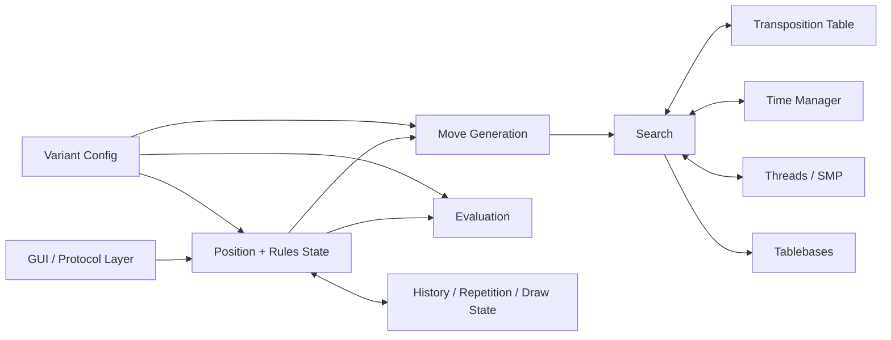

# Developing Non-Neural Variant-Capable Chess Engines

## Executive summary

Classical chess engines are still built around the same basic insight that entity["people","Claude Shannon","information theorist"] articulated in 1950: the program searches a game tree and uses an evaluation function to approximate the value of positions it cannot search to the end. In modern practice, “minimax” is usually implemented as negamax plus alpha–beta pruning, wrapped in iterative deepening, fed by aggressive move ordering, stabilized by quiescence search, and accelerated by transposition tables keyed with Zobrist-style hashes. That stack remains the canonical blueprint for strong non-neural play. citeturn27view0turn27view1turn27view2turn28view0turn27view5turn27view8

For chess variants, the search machinery is often reusable, but the engine must stop treating “the rules” as hard-coded assumptions. Variant engines need a first-class rules layer that can change terminal conditions, draw rules, pockets, check counters, compulsory captures, explosion mechanics, and board geometry. Engines that do this well either make rule changes declarative, as in Fairy-Stockfish’s `variants.ini`, or keep a more general board/move framework that can tolerate many piece types and board sizes, as in Sjaak II and Fairy-Max. citeturn16search0turn14view1turn17view0turn37search5turn37search17

The open-source ecosystem is concentrated. If the requirement is “broad multi-variant support with a classical search core,” Fairy-Stockfish is the clear center of gravity; if the requirement is “specialized support for giveaway/losers/crazyhouse,” legacy engines such as Sjeng still matter because they expose concrete variant-specific search decisions, including proof-number search in losing-chess modes. AntiCrux is useful as a transparent antichess-specific design, and Sjaak II and Fairy-Max are especially instructive for understanding how general rule frameworks trade raw speed for extensibility. citeturn40view2turn15view0turn14view7turn41view2turn36view3turn17view0turn43view1

The main engineering takeaway is practical: if you want a strong, variant-capable non-NN engine, build the engine as `rules + state + move generator + search + eval`, not as “standard chess with patches.” Make the state hash variant-complete, make the move generator parameterized, make pruning switchable per variant, and make the evaluation features variant-specific. That architecture is more important than any single heuristic. citeturn14view1turn16search0turn17view0turn39view0

## Core algorithms and data representations

The theoretical spine is still minimax, but practical engines almost always implement the equivalent negamax form with alpha–beta windows. entity["people","Donald E. Knuth","computer scientist"] and entity["people","Ronald W. Moore","computer scientist"] analyzed alpha–beta pruning rigorously in 1975 and showed why move ordering is decisive: alpha–beta is only as good as the order in which promising moves are tried. In effect, the engine is not just “searching more deeply”; it is trying to find the cutoff-causing move as early as possible. citeturn27view1

In strong engines, the search loop is normally iterative deepening rather than “one fixed-depth search.” entity["people","Tony Marsland","computer scientist"] compared enhancements such as iterative deepening, memory tables, aspiration search, and principal-variation search, and modern engines still reflect that package. Current Stockfish source, for example, literally runs a main iterative-deepening loop that increases depth until time or depth limits are reached. Iterative deepening is not just a time-control convenience; together with a transposition table, it materially improves move ordering by feeding each deeper iteration with good principal-variation and hash moves from the previous iteration. citeturn27view2turn12search7turn30view0

Quiescence search exists because fixed-depth cutoff positions are often tactically unstable. Hermann Kaindl’s work on variable-depth search frames the central problem clearly: if the leaf position still contains forcing captures, checks, or promotion threats, a purely static evaluation is unreliable. In practice, engines therefore replace “evaluate at depth 0” with “search only volatile moves until the position is quiet enough.” Variant engines inherit the same need, but what counts as “volatile” changes by variant. citeturn28view0

Move ordering is the other major multiplier. The history heuristic that entity["people","Jonathan Schaeffer","computer scientist"] introduced is still foundational: successful moves are remembered and tried earlier later in the tree. Practical engines combine several signals—hash move, principal-variation move, captures ordered by SEE or MVV-LVA, killer moves, continuation/history tables, and variant-specific forcing moves. Sjeng’s README is useful here because it names the classical bundle explicitly: history and killer moves, SEE move ordering, transposition tables, PVS, null-move pruning, futility pruning, and razoring. citeturn27view5turn41view2

Transposition tables are the memory system that turns a tree search into a graph search. They store results of already searched positions—typically a Zobrist key, depth, bound type, score, and best move—and are critical both for pruning and for move ordering. Zobrist-style hashing became standard because it allows incremental updates on make/unmake. Later work by entity["people","Robert Hyatt","chess programmer"] and entity["people","Timothy Mann","software engineer"] showed how to share TTs efficiently across parallel search without locking every access, while Hyatt and Cozzie also studied the practical effect of hash collisions. citeturn1search3turn27view8turn27view10

For board representation, bitboards dominate orthodox 8×8 engines because one 64-bit word maps naturally to the board, enabling very fast attack generation and set operations. Hyatt’s rotated-bitboard work is a landmark example of this family of ideas. But variant engines expose the main counterpoint: once the board is not 8×8, or pieces are highly configurable, a more generic representation becomes attractive. H. G. Muller’s micro-Max documentation shows the classic 0x88 representation, and Fairy-Max inherits that lineage with step-vector move generation and configuration-driven piece definitions. Sjaak’s design notes similarly describe a bitboard-based board representation in a general framework. The engineering trade-off is simple: bitboards are extremely fast on fixed 8×8 rules; generic representations are usually easier to extend across arbitrary boards and move rules. citeturn27view7turn35view0turn31search12turn31search0turn37search17

A useful way to summarize the classical stack is this recurrence:

```text
search(position, depth, alpha, beta):
    if depth <= 0:
        return qsearch(position, alpha, beta)

    if TT hit is usable:
        return stored bound or use stored move first

    moves = ordered_moves(position)
    best = -INF
    for move in moves:
        make(move)
        score = -search(child, depth - 1, -beta, -alpha)
        unmake(move)

        best = max(best, score)
        alpha = max(alpha, score)
        if alpha >= beta:
            record cutoff data
            break

    store TT entry
    return best
```

That pseudocode is intentionally plain, but the strong-engine reality is exactly this loop plus a substantial amount of engineering around move ordering, reductions, extensions, TT usage, and time management. citeturn27view1turn27view2turn30view0turn30view3

## Typical architecture and implementation trade-offs

A strong classical variant engine is best thought of as a modular pipeline, with a rule layer between “position” and everything else:



That architecture is not accidental. Fairy-Stockfish exposes it very directly: it derives from Stockfish, but supports many built-in variants and user-defined rules loaded from configuration without recompilation. Sjaak II and Fairy-Max sit at different points on the same spectrum: both emphasize generality, but through different internal representations and protocol ecosystems. citeturn40view2turn16search0turn17view0turn43view1turn37search5

The first big trade-off is **performance versus generality**. A tightly optimized orthodox engine can hard-code assumptions about board size, castling, legal-check structure, and piece interactions. A general variant engine cannot. Fairy-Stockfish addresses this by keeping Stockfish-style strength while making many rule changes declarative in `variants.ini`; Fairy-Max pushes even harder toward configurable step-vector movement and externalized definitions; Sjaak II keeps a general chess-like framework but explicitly notes that supporting some variants such as atomic or giveaway would require move-generator and move-storage changes that the author chose not to make. In other words, “variant-capable” usually means accepting some complexity tax in the core. citeturn14view1turn16search0turn17view0turn35view0turn37search17

The second trade-off is **memory versus search efficiency**. Larger hash tables reduce repeated work, but they also increase memory pressure and bandwidth demands. Contemporary Stockfish documentation still treats TT size as a first-order tuning knob and notes that large pages can improve hash access efficiency, with typical node-per-second gains of 5–10% and occasionally much more. In parallel engines, TT design also becomes part of the synchronization story, which is exactly why lockless TT designs became important. citeturn39view0turn27view8

The third trade-off is **parallelism versus determinism and complexity**. Shared-hash Lazy SMP is attractive because it is simple and scales well relative to more elaborate parallel alpha–beta schemes. Stockfish’s own documentation describes Lazy SMP as multiple threads sharing the transposition table, thereby filling the table faster and widening the effective search. But parallel search also makes debugging harder, can reduce exact reproducibility, and complicates replacement behavior and time management. For many experimental variant engines, getting the single-threaded engine right first is the better sequence. citeturn27view9turn27view8

The fourth trade-off is **specialized endgame knowledge versus portability**. Standard chess has mature Syzygy support integrated in engines and documented as a production feature, including handling of the 50-move rule and the ability to preselect all good moves in tablebase positions. Variant chess rarely has an equivalent ecosystem. Among the projects I reviewed, the clearest explicit variant-tablebase integration was a Fairy-Stockfish fork extended for antichess DTW endgame tablebases. That asymmetry matters: in orthodox chess, tablebases are an engineering option; in variants, they are usually a specialized research project. citeturn39view0turn38view0

## Open-source engines that support chess variants

The table below focuses on engines with a classical search core, or on engines that explicitly retain a non-NN mode.

| Engine | Primary language | License | Variant support most relevant here | Key design choices |
|---|---|---|---|---|
| Fairy-Stockfish | C++ | GPL-3.0 | antichess/giveaway/suicide/losers, 3-check, atomic, crazyhouse, bughouse, many others, plus user-defined variants | Stockfish-derived search; handcrafted evaluation by default; rules loaded from `variants.ini`; optional NNUE |
| Sjeng | C | GPL-2.0 | standard, crazyhouse, bughouse, suicide/giveaway/antichess, losers | advanced alpha–beta stack; SEE ordering; PVS; proof-number search in suicide/losers |
| Sjaak II | C++ | GPL-3.0 | broad chess-like framework; explicit support docs for many variants, but author explicitly excludes atomic/losers/giveaway | general framework; from-scratch move generation/eval/search; bitboard-based design inherited from Jazz |
| AntiCrux | JavaScript | AGPL-3.0 | antichess / suicide / losing chess / giveaway | transparent, forced-move-aware tree search with explicit depth/node controls |
| Anti-Fairy | C++ | GPL-3.0 | many antichess variants | Fairy-Stockfish fork specialized for antichess-variant play |
| fairy-stockfish-egtb | C++ | GPL-3.0 | antichess with DTW endgame-tablebase support | Fairy-Stockfish clone extended to probe antichess EGTB |
| Fairy-Max | C | repository exposes a license file, but the fetched metadata did not surface the SPDX string clearly | user-defined variants, ShaMax/Shatranj, MaxQi/Xiangqi, and many large-board fairy-piece variants defined in `fmax.ini` | XBoard-compatible, config-driven step-vector move generation, micro-Max 0x88 heritage |

Fairy-Stockfish is the broadest and most important open-source project in this space. Its repository and website state that it is a variant engine derived from Stockfish, supports a long list of built-in variants—including crazyhouse, atomic, antichess/giveaway/losers, and three-check—and can load user-defined variants from configuration at runtime. Its NNUE page is especially relevant here because it says the engine uses a handcrafted evaluation by default and can optionally load variant-specific NNUE files; that means Fairy-Stockfish is still a valid classical-engine platform even though many of its strongest deployments now use NNUE. citeturn40view2turn15view0turn14view7turn16search0turn26search5

Sjeng remains one of the clearest documented examples of a classical variant engine family. Its README explicitly says it plays crazyhouse, bughouse, suicide/giveaway/antichess, and losers, and describes itself as a highly advanced alpha–beta searcher with history and killer moves, transposition tables, SEE ordering and pruning, selective extensions, aspiration PVS, adaptive null-move pruning, extended futility pruning, and limited razoring. Crucially, it also says that in suicide and losers mode it uses proof-number search to find forced wins quickly. That is exactly the sort of variant-specific search choice that a standard chess tutorial often omits. citeturn41view2

Sjaak II is architecturally interesting because it is explicitly presented as a “general framework for playing chess-like games.” Its README says the move generator, evaluation function, and search were written from scratch, and its design notes say the board representation is a collection of bitboards inherited from the author’s Jazz engine. The same README is also unusually honest about limits: it may mishandle some repetition details in general form, and the author says atomic/losers/giveaway would require changes to move generation and move storage. That is valuable evidence that variant support is not “just a new eval.” It can require deep changes to legality, state, and search assumptions. citeturn17view0turn31search0

AntiCrux is not the strongest engine in the set, but it is one of the most transparent. It describes itself as a JavaScript library/engine for antichess, suicide chess, or losing chess; it exposes UCI integration; and its developer notes explain that the engine searches “level by level,” benefits from the reduced branching caused by forced captures, and treats depth and node limits as explicit configuration parameters. For someone implementing a losing-chess engine, AntiCrux is useful because its design notes make the branch-factor consequences of mandatory captures very concrete. citeturn36view3turn36view1turn32view1turn32view2turn36view0

Anti-Fairy and fairy-stockfish-egtb are narrower but still instructive. Anti-Fairy is a Fairy-Stockfish fork described as supporting many antichess variants for liantichess, which makes it a good example of specialization by forking a broad platform. The `fairy-stockfish-egtb` fork is even more specific: it states that it adds antichess DTW endgame-tablebase support to a Fairy-Stockfish clone. Together they show a pattern common in variant engines: once the base architecture is sufficiently general, specialization often happens by forks that alter search or endgame tooling rather than by greenfield engines. citeturn23view0turn24view1turn38view0

Fairy-Max is older and weaker, but it remains one of the best didactic examples of a rule-driven variant engine. The repository states that it is an XBoard-compatible chess-variant engine with derivatives for Shatranj and Xiangqi, and `fmax.ini` contains concrete variant definitions for games such as Capablanca, Gothic, and Janus. The official Fairy-Max page emphasizes its purpose as an engine for empirically evaluating fairy pieces, while Chessprogramming’s overview highlights step-vector move generation and knowledge of leapers versus sliders. In other words, Fairy-Max is less a state-of-the-art competitor than a compact demonstration of how to turn piece definitions and board geometry into a classical search engine. citeturn43view1turn22view0turn37search5turn37search17turn35view0

The high-level pattern across these projects is clear. Broad-support engines are rare, and when they exist they tend to be configuration-heavy frameworks rather than narrow “standard chess engines with a switch.” Specialized engines then either target a single variant family, as AntiCrux does for losing chess, or fork the platform to add a specialized search/endgame capability, as with antichess EGTB support. citeturn40view2turn41view2turn36view3turn38view0

## How engine design diverges for variants

The first difference is **rule handling and serialized state**. Standard-chess engines can bake terminal conditions into the core: mate, stalemate, 50-move rule, repetition, castling rights, and en passant. Variant engines cannot. Fairy-Stockfish’s `variants.ini` is the clearest single artifact here: it contains flags such as `mustCapture`, `checkCounting`, `pieceDrops`, `capturesToHand`, `blastOnCapture`, `stalemateValue`, `extinctionValue`, `nFoldRule`, `nMoveRule`, `perpetualCheckIllegal`, and pocket/drop constraints. That is a compact catalog of the extra rule-state a variant engine must expose to move generation, hashing, repetition detection, and terminal evaluation. citeturn14view1

The second difference is **move generation**. In three-check, legal move generation is essentially standard chess, but the state must track cumulative checks because the third legal check wins immediately. In antichess, if any capture exists, non-captures are illegal, so move generation must be two-stage: generate captures first and only if none exist, generate quiet moves. In crazyhouse, the move generator must also generate legal drops from the pocket, observe rank restrictions for pawn drops, and restore captured promoted pawns as pawns. In atomic chess, captures have explosion semantics, and legality must account for the fact that a player may not make a move that explodes their own king; kings also cannot simply behave as in standard chess around adjacent explosions. citeturn44search2turn44search3turn44search1turn44search0turn44search8turn44search11turn14view1

The third difference is **evaluation**. This is where many standard-engine ports fail. Inference from the rules is unavoidable, but it is strong inference. Because antichess is won by losing all your pieces or by being stalemated—and because captures are mandatory—a normal material-positive evaluation is often directionally wrong. AntiCrux’s notes and Sjeng’s use of proof-number search for losers modes both reinforce the point that forcing structure dominates. In crazyhouse, “material” includes pieces in hand and drop threats, so king safety and pocket tempo become much more important than in standard chess. In three-check, the evaluation must account for remaining checks as a game-ending resource. In atomic, “king safety” becomes “blast safety”: adjacency, explosive captures, and discovered detonation motifs matter more than conventional static shelter terms. These are not arbitrary stylistic choices; they follow from the terminal and legality rules. citeturn44search3turn32view1turn41view2turn44search1turn44search2turn44search0turn44search11

The fourth difference is **pruning and search depth policy**. Some heuristics travel well; others do not. AntiCrux states explicitly that forced moves in antichess shrink the tree and permit deeper search. That makes losing-chess engines unusually tolerant of full-width search in tactical forcing lines. By contrast, crazyhouse and atomic are far more tactically explosive: drops and explosions generate volatile tactical leaves, which means quiescence must be redefined and reductions/pruning become riskier. A related standard-chess caution appears in Marsland’s overview of null-move pruning: even in orthodox chess, null move must be treated carefully in zugzwang-prone endgames; variants with compulsory capture, exotic terminal rules, or tactical drops often invalidate the “doing nothing should not help” assumption even more aggressively. That is an inference, but it is an evidence-based one. citeturn32view1turn28view0turn44search1turn44search0turn12search15

The fifth difference is **draw rules and repetition semantics**. Fairy-Stockfish exposes configurable fold and move rules directly in the variant format, including altered values for n-fold repetition and no-progress rules. Sjaak II’s README is useful because it describes how even in standard chess, getting repetition state right is nontrivial once castling and en-passant rights are generalized; the author says Sjaak currently omits some of that in the generalized signature, which can lead to incorrect draw claims. A variant-capable engine therefore has to define, explicitly and per variant, exactly which pieces of history belong in the hash and repetition state. citeturn14view1turn17view0

The sixth difference is **endgame knowledge**. Orthodox chess has standardized Syzygy integration and a mature DTZ/WDL ecosystem. Variant chess usually does not. The notable exception I found in the reviewed codebases is the `fairy-stockfish-egtb` fork adding antichess DTW tablebases. That is revealing: variant endgames are not just “tablebases later.” They often require new metrics, new retrograde logic, and new legality/state models. citeturn39view0turn38view0

## Variant-specific pseudocode and implementation patterns

The most robust pattern is to make the rules data-driven, then let move generation and evaluation branch on rules rather than on hard-coded variant names. Fairy-Stockfish’s configuration format strongly suggests this architecture: a variant definition becomes a structured bundle of booleans, counters, pockets, board dimensions, and piece descriptions, including a subset of Betza notation for custom movement. citeturn16search0turn26search5turn14view1

A minimal rules object looks like this:

```cpp
struct Rules {
    bool mustCapture            = false;   // antichess/giveaway
    bool checkCounting          = false;   // three-check
    int  checksToWin            = 0;       // e.g. 3
    bool pieceDrops             = false;   // crazyhouse
    bool capturesToHand         = false;   // crazyhouse/bughouse
    bool blastOnCapture         = false;   // atomic
    Outcome stalemateValue      = DRAW;
    Outcome repetitionValue     = DRAW;
    int nFoldRule               = 3;
    int nMoveRule               = 100;     // half-moves
    PocketPolicy pocketPolicy;
    PromotionPolicy promotionPolicy;
    BoardGeometry geometry;
};
```

For antichess, the key move-generation change is compulsory capture. This is not a search heuristic; it is a legality rule. citeturn44search3turn14view1

```cpp
vector<Move> generateLegalMoves(const Position& pos, const Rules& rules) {
    vector<Move> captures = generatePseudoLegalCaptures(pos, rules);
    captures = filterLegal(pos, captures, rules);

    if (rules.mustCapture && !captures.empty())
        return captures;

    vector<Move> quiets = generatePseudoLegalQuiets(pos, rules);
    quiets = filterLegal(pos, quiets, rules);

    if (rules.mustCapture)
        return quiets;   // only if no capture exists

    captures.insert(captures.end(), quiets.begin(), quiets.end());
    return captures;
}
```

For crazyhouse, the generator must merge normal board moves with pocket-drop moves while enforcing pocket-specific constraints, including no pawn drops on the first or eighth rank. citeturn44search1turn14view1

```cpp
vector<Move> generateCrazyhouseMoves(const Position& pos, const Rules& rules) {
    vector<Move> moves = generateStandardChessMoves(pos);

    for (Piece p : pos.pocket[pos.sideToMove]) {
        for (Square sq : emptySquares(pos.board)) {
            if (p == PAWN && (rankOf(sq) == 1 || rankOf(sq) == 8))
                continue;

            Move drop = makeDrop(p, sq);

            if (dropLeavesOwnKingIllegal(pos, drop, rules))
                continue;

            moves.push_back(drop);
        }
    }

    if (rules.mustCapture) {
        auto captures = filterCapturesOrCheckingDropsIfVariantRequires(pos, moves, rules);
        if (!captures.empty()) return captures;
    }

    return moves;
}
```

For three-check, move generation is almost orthodox; the critical changes are state accounting and terminal detection. citeturn44search2turn14view1

```cpp
Score evaluateThreeCheck(const Position& pos) {
    if (pos.checksGiven[WHITE] >= 3) return WIN_FOR_WHITE;
    if (pos.checksGiven[BLACK] >= 3) return WIN_FOR_BLACK;

    Score s = evaluateOrthodoxFeatures(pos);  // material, mobility, king safety, etc.

    // Variant term: checking potential matters materially more.
    s += 80 * (pos.checksGiven[WHITE] - pos.checksGiven[BLACK]);
    s += 20 * (immediateCheckingMoves(pos, WHITE) - immediateCheckingMoves(pos, BLACK));
    return s;
}

void applyMove(Position& pos, Move m, const Rules& rules) {
    makeOrthodoxMove(pos, m);

    if (rules.checkCounting && moveGivesCheck(pos, m))
        pos.checksGiven[sideJustMoved(pos)]++;
}
```

For atomic chess, the move applier must incorporate explosion semantics and reject self-destructive king explosions. The Lichess rule summary is enough to implement the core logic: captures explode the capturing piece, the captured piece, and adjacent non-pawns; a move that explodes your own king is illegal. citeturn44search0turn44search8turn44search11

```cpp
bool applyAtomicCapture(Position& pos, Move m) {
    Square to = m.to;
    Color us = pos.sideToMove;
    Color them = opposite(us);

    // Tentatively make the capture.
    Piece moving = pos.board[m.from];
    pos.board[m.from] = EMPTY;
    pos.board[to] = moving;

    vector<Square> blast = {to};
    for (Square n : adjacentSquares(to))
        blast.push_back(n);

    // Capturing piece always disappears in atomic.
    // Adjacent pawns are exempt from blast removal.
    for (Square sq : blast) {
        Piece pc = pos.board[sq];
        if (pc == EMPTY) continue;
        if (sq != to && typeOf(pc) == PAWN) continue;
        pos.board[sq] = EMPTY;
    }

    if (!kingExists(pos, us))
        return false; // illegal: own king exploded

    pos.sideToMove = them;
    return true;
}
```

The evaluation lesson across all four snippets is the same: variant support is cleaner when the engine treats “legal move generation,” “terminal test,” and “evaluation features” as three separate variant-aware functions. That separation is what lets you reuse the alpha–beta core while changing the game. citeturn14view1turn16search0turn41view2

## Checklist for implementing a variant-capable classical engine

A recommended implementation checklist is:

- **Define a structured rules object first.** Include board geometry, terminal conditions, move-history rules, pocket rules, check counters, and piece definitions before writing search code. Fairy-Stockfish’s configuration model is the best concrete example of why this matters. citeturn16search0turn14view1turn26search5
- **Extend the hashed state completely.** If the variant has pockets, check counters, altered castling/en-passant semantics, no-progress counters, or special repetition rules, all of that state must be reflected in hashing and repetition logic. Sjaak II’s own caveat shows what happens when generalized signatures are incomplete. citeturn17view0turn14view1
- **Write perft-style move-generation tests before tuning search.** Do this separately for orthodox rules, compulsory-capture rules, drop rules, and explosion rules. Otherwise alpha–beta bugs will camouflage legality bugs. citeturn35view0turn23view2
- **Make quiescence variant-aware.** In standard chess, captures/checks/promotions dominate qsearch. In crazyhouse you may need drop-check/drop-defense treatment; in atomic you may need explosion-sensitive leaf handling; in antichess you may want compulsory capture continuation rules. citeturn28view0turn44search1turn44search0turn44search3
- **Treat pruning heuristics as per-variant options, not universal truths.** Null move, futility, LMR, and SEE assumptions can weaken badly when the variant changes legality or tactical volatility. Sjeng’s losers-mode proof-number search is a good reminder that some variants need different selective tools entirely. citeturn41view2turn12search15turn32view1
- **Design evaluation as variant-specific feature sets on a shared framework.** Reuse the evaluator interface, not necessarily the features. Material, mobility, piece-square tables, king safety, pocket value, check counters, escape squares, and sacrificial motifs need different weights—or different signs—across variants. citeturn27view0turn44search1turn44search2turn44search3
- **Separate protocol concerns from game logic.** UCI/XBoard/CECP compatibility matters, but it should be an outer layer over a variant-aware engine core, not intertwined with search or legality. Broad-support engines consistently follow that pattern. citeturn40view2turn17view0turn43view1
- **Benchmark both strength and throughput.** Measure nodes per second, TT hit rate, branching factor, move-generation speed, and tactical test performance per variant. Stockfish’s documentation on speed and large pages is still relevant even for non-NN engines. citeturn39view0
- **Delay tablebase work unless the variant justifies it.** Standard Syzygy is ready-made; most variant TB work is bespoke. Build a strong search engine first, then add retrograde analysis if the variant is stable and important enough. citeturn39view0turn38view0

### Open questions and limitations

The biggest uncertainty in the project catalog is Fairy-Max licensing: the repository metadata clearly exposes a license file, but the fetched snippet did not surface the exact SPDX identifier, so I report that row conservatively. Also, some statements about which pruning heuristics are likely to fail in atomic or crazyhouse are reasoned inferences from the rules and from classical engine behavior, not explicit maintainer statements in the codebases I reviewed. Finally, Sjaak II’s broad variant coverage is clear at the framework level, but the particular examples attached here rely partly on secondary documentation because the fetched `variants.txt` view did not expose named variants cleanly in the accessible snippet. citeturn43view1turn44search0turn44search1turn17view0

